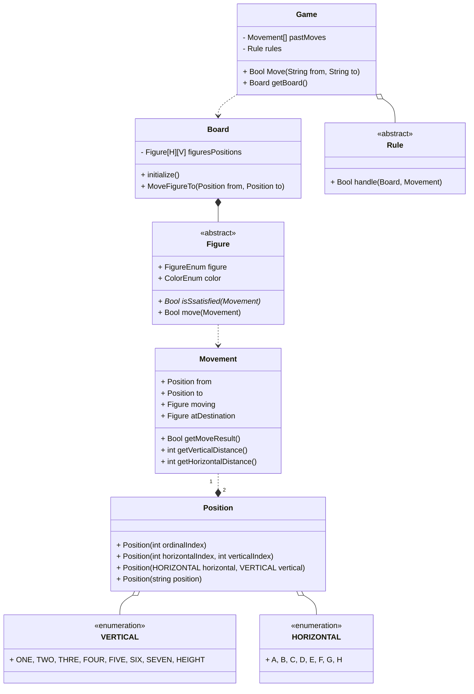

Pour ma première application Java, j'ai conçu ce jeu d'échec. 
La conception est faite selon les bonnes pratiques du Domain Driven Design. Le site [chess.com](https://www.chess.com/learn-how-to-play-chess) m'a servi de support pour toutes les règles métiers.

Ce module est exempt de persistance et de présentation et par conséquent ne présente pas de repository.
Seulement un unique aggrégat `Game`.

L'aggrégat `Game` ne présente qu'une seule méthode publique `Move` qui permet de déclencher le déplacement d'une position vers une autre.
Le getter `getBoard` sert à récupérer l'état du plateau (`Board`) 
Un déplacement est considéré valide même s'il ne contient pas de `Figure` à la position `from`. Cela permet d'augmenter les possibilités des règles.

Dans la version classique, la règle `PositionRule` vérifie qu'on ne fait pas un déplacement sur la même position et qu'un déplacement contient une `Figure`.

Le `Board` initialize le placement des `Figure` et maintient l'état actuel de la position de chacune.
Les positions sont stockées dans un tableau à deux dimensions : 1ère dimension = Position Horizontal, 2ème dimension = Position Vertical. Exemple : Figure[H][5].

## Évolutions futures
- Pattern memento pour les déplacements
- Undo des déplacements
- Implémenter les règles de [variantes](https://www.chess.com/article/view/chess-variants)
- Implémenter la règle [Promotion](https://www.chess.com/article/view/do-you-know-how-to-promote-a-pawn)
